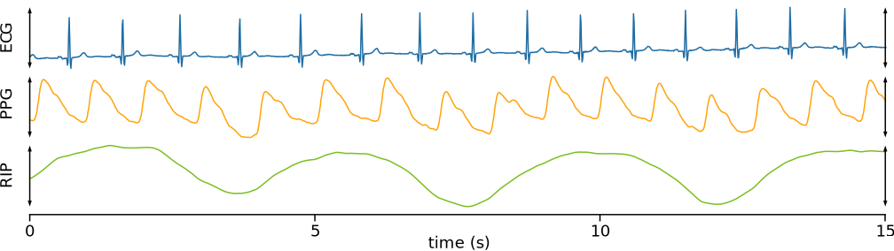

# Sample Biosignals

This repository contains a 15-second sample of three synchronized biosignals:

- **ECG**: electrocardiogram, captured from lead I (across the chest)
- **PPG**: photoplethysmogram, captured from the right fingertip
- **RIP**: Respiratory inductance plethysmography, captured from the abdomen

The signals were collected using a BioRadio sensor pod from Great Lakes Neurotechnologies.

